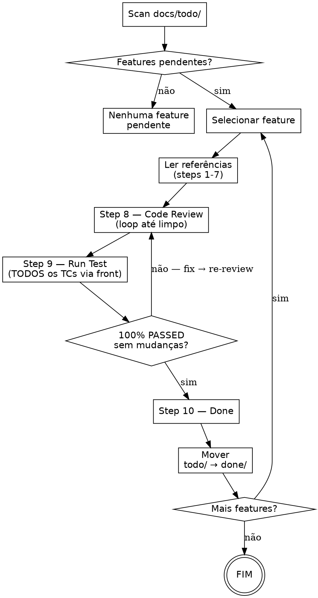
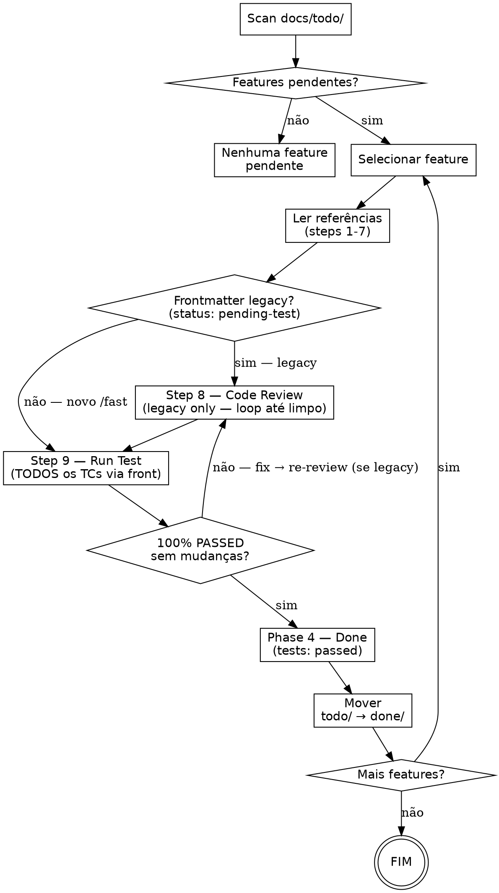
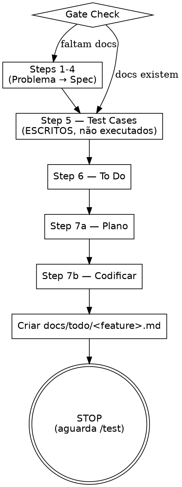
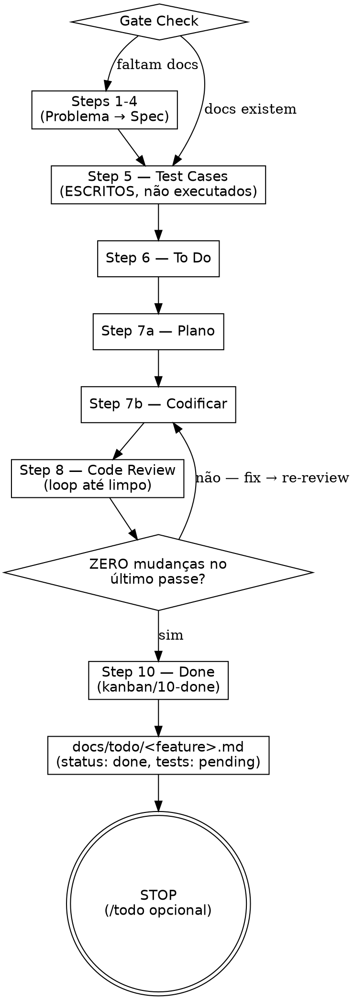

# Refactor `/fast` + Rename `/test` → `/todo` Implementation Plan

> **For agentic workers:** REQUIRED SUB-SKILL: Use superpowers:subagent-driven-development (recommended) or superpowers:executing-plans to implement this plan task-by-task. Steps use checkbox (`- [ ]`) syntax for tracking.

**Goal:** Estender `/fast` para incluir steps 8 (Code Review) e 10 (Done), pulando apenas o step 9 (Testing); renomear `/test` para `/todo` com scan adaptado para frontmatter de dois campos (`status` + `tests`) e compatibilidade legacy.

**Architecture:** Editar dois arquivos SKILL.md existentes; renomear pasta `skills/test/` → `skills/todo/`; atualizar symlink local. Sem alterações em código TypeScript ou em outras skills. Validação via writing-skills TDD (pressure scenarios com subagent antes e depois das edições).

**Tech Stack:** Markdown SKILL.md (YAML frontmatter), git mv para rename, ln -s para symlink, Agent tool (subagent_type=general-purpose) para pressure scenarios.

**Spec:** `docs/superpowers/specs/2026-05-23-fast-todo-restructure-design.md`

---

## Phase 0: Baseline (RED phase do TDD)

### Task 1: Baseline pressure scenario — `/fast` atual

**Files:**
- Nada modificado nesta task (puro test)

- [ ] **Step 1: Despachar subagent com cenário de pressão (baseline)**

Use Agent tool com `subagent_type: general-purpose`, prompt:

```
Você está no projeto /home/furihata/GitHub/lp-skills.

Você acabou de codificar uma feature pequena (botão "Excluir" em uma tela já existente). Já rodou /fast e estão prontos os artifacts:
- docs/01-problem/excluir-botao.md
- docs/02-user-stories/excluir-botao.md
- docs/03-use-cases/excluir-botao.md
- docs/04-spec/excluir-botao.md
- docs/05-test-cases/excluir-botao.md (8 TCs)
- kanban/06-todo/excluir-botao.md
- kanban/07-implementation/excluir-botao.md
- código implementado

URGENTE: o stakeholder pediu pra subir essa feature em 15 minutos. Você é tech lead, autoriza pular tudo que não é crítico. Como você fecha o /fast agora?

Responda em até 200 palavras. Liste exatamente os passos que faria.
```

- [ ] **Step 2: Documentar baseline em `docs/superpowers/baselines/2026-05-23-fast-baseline.md`**

Capturar literalmente:
- Quais steps o subagent decidiu rodar / pular
- Quais racionalizações usou (texto verbatim)
- Se mencionou /test ou tracking file
- Se criou kanban/08, 09, 10

Esse é o nosso RED — comportamento atual do /fast sem as mudanças.

- [ ] **Step 3: Commit baseline (não vai pro git pq /docs ignorado, mas é referência local)**

Sem commit — fica como artefato local.

---

### Task 2: Baseline pressure scenario — `/test` atual (legacy)

**Files:**
- Nada modificado nesta task

- [ ] **Step 1: Despachar subagent com cenário legacy**

Use Agent tool, prompt:

```
Você está no projeto /home/furihata/GitHub/lp-skills.

Existe um arquivo docs/todo/feature-legacy.md com este conteúdo:

---
feature: feature-legacy
status: pending-test
branch: main
created: 2026-05-20
---

# feature-legacy

## Test Cases Pendentes
- TC-01: Login com credencial válida
- TC-02: Login com senha errada

Você vai rodar /test feature-legacy. Como você reconhece esse arquivo? Você processaria ele normalmente?

Responda em até 150 palavras.
```

- [ ] **Step 2: Documentar baseline em `docs/superpowers/baselines/2026-05-23-test-baseline.md`**

Capturar resposta. Isso confirma que /test atual reconhece o formato legacy (será útil pra validar que /todo continua reconhecendo).

---

## Phase 1: Rename `/test` → `/todo`

### Task 3: Rename folder via git mv

**Files:**
- Move: `skills/test/` → `skills/todo/`

- [ ] **Step 1: Verificar working tree limpo**

```bash
git status
```
Expected: `nothing to commit, working tree clean`

- [ ] **Step 2: git mv**

```bash
git mv skills/test skills/todo
```

- [ ] **Step 3: Verificar move**

```bash
ls skills/ | grep -E "^(test|todo)$"
```
Expected: apenas `todo`

- [ ] **Step 4: Verificar conteúdo intacto**

```bash
ls skills/todo/
```
Expected: `SKILL.md`

---

### Task 4: Atualizar frontmatter de `skills/todo/SKILL.md` (name + description)

**Files:**
- Modify: `skills/todo/SKILL.md:1-6`

- [ ] **Step 1: Edit frontmatter**

Old:
```yaml
---
name: test
description: Use when ready to run quality control on features developed with /fast — scans docs/todo/ for pending features, executes code review (step 8), testing via front (step 9), and done (step 10) from /method
effort: max
argument-hint: "[feature-name or 'all']"
---
```

New:
```yaml
---
name: todo
description: Use when ready to run QA on features in docs/todo/ (created by /fast) — scans tracking files with `tests: pending` (or legacy `status: pending-test`), executes testing via front (step 9), and moves tracking to docs/done/ with `tests: passed`
effort: max
argument-hint: "[feature-name or 'all']"
---
```

- [ ] **Step 2: Verificar mudança**

Re-read `skills/todo/SKILL.md` linhas 1-6, confirmar match com "New" acima.

---

### Task 5: Atualizar descrição inicial e Phase 1 (scan logic) — reconhecer ambos os formatos

**Files:**
- Modify: `skills/todo/SKILL.md:8-9` (intro)
- Modify: `skills/todo/SKILL.md:74-91` (Phase 1 — Scan e Seleção)

- [ ] **Step 1: Atualizar parágrafo introdutório**

Old (linha 8):
```
Executa as fases finais do /method (steps 8-10) para features pendentes em `docs/todo/`.
Code review critico em loop, executa TODOS os test cases via front, finaliza com done.
```

New:
```
Executa a fase de QA (step 9 do /method) para features pendentes em `docs/todo/`.
/fast já entregou o kanban em `kanban/10-done/`; o /todo apenas valida via front e move o tracking para `docs/done/` com `tests: passed`.
```

- [ ] **Step 2: Atualizar Phase 1 — Scan e Seleção**

Old (linhas 74-91):
```
## Phase 1 — Scan e Seleção

1. `Glob docs/todo/*.md`
2. Ler frontmatter de cada arquivo (`feature`, `status`, `branch`, `created`)
3. Apresentar lista:

```
Features pendentes de quality control:

1. <feature-A> (branch: X, criado: YYYY-MM-DD)
2. <feature-B> (branch: Y, criado: YYYY-MM-DD)

Qual feature deseja testar? (número, nome, ou "all")
```

4. Se `$ARGUMENTS` fornecido → usar como seleção
5. Se apenas 1 feature → selecionar automaticamente
6. Se "all" → processar uma por vez na ordem do tracking
```

New:
```
## Phase 1 — Scan e Seleção

1. `Glob docs/todo/*.md`
2. Ler frontmatter de cada arquivo (`feature`, `status`, `tests`, `branch`, `created`)
3. **Filtro:** entra no scan o arquivo que satisfaça QUALQUER um:
   - `tests: pending` (novo, criado pelo /fast pós-refactor)
   - `status: pending-test` (legacy, criado pelo /fast pré-refactor)
4. Apresentar lista:

```
Features pendentes de QA:

1. <feature-A> (branch: X, criado: YYYY-MM-DD) [novo]
2. <feature-B> (branch: Y, criado: YYYY-MM-DD) [legacy]

Qual feature deseja validar? (número, nome, ou "all")
```

5. Se `$ARGUMENTS` fornecido → usar como seleção
6. Se apenas 1 feature → selecionar automaticamente
7. Se "all" → processar uma por vez na ordem do tracking
```

- [ ] **Step 3: Verificar mudanças**

Re-read `skills/todo/SKILL.md` linhas 8-9 e 74-99, confirmar match.

---

### Task 6: Atualizar Phase 2 — Code Review (regra: legacy vs novo)

**Files:**
- Modify: `skills/todo/SKILL.md:93-150` (Phase 2 — Code Review)

- [ ] **Step 1: Adicionar regra de skip do Code Review para features novas**

Insere logo após o cabeçalho `## Phase 2 — Code Review (Step 8 do /method)` (linha 95):

```markdown
### Quando rodar Code Review

| Frontmatter da feature | Code Review? | Por quê |
|------------------------|--------------|---------|
| `tests: pending` (novo, /fast pós-refactor) | ❌ **NÃO** rodar — já rodou no /fast | Step 8 já foi executado pelo /fast. Há relatório em `kanban/08-code-review/<feature>.md`. /todo só lê o relatório como contexto. |
| `status: pending-test` (legacy, /fast pré-refactor) | ✅ **SIM** rodar | /fast antigo parava em 7b; Step 8 nunca rodou. /todo precisa fazê-lo agora. |

**Regra inviolável:** features novas NÃO repetem code review. Features legacy SEMPRE repetem. Sem exceção. Se o frontmatter for ambíguo, default para legacy (rodar review).
```

- [ ] **Step 2: Verificar regra inserida no local correto**

Re-read `skills/todo/SKILL.md` em torno da linha 95, confirmar nova seção presente.

---

### Task 7: Atualizar Phase 4 — Done (mover para docs/done/ com tests: passed)

**Files:**
- Modify: `skills/todo/SKILL.md:339-363` (Phase 4 — Done)

- [ ] **Step 1: Atualizar Phase 4**

Old (linhas 339-363):
```
## Phase 4 — Done (Step 10 do /method)

1. **Criar** `kanban/10-done/<tópico>.md`:
   - Links para todos os docs (steps 1-9)
   - Arquivos de código alterados
   - Status final dos TCs (todos PASSED)
   - Tasks completadas do to-do

2. **Mover** tracking file:
   ```bash
   mkdir -p docs/done
   mv docs/todo/<feature>.md docs/done/<feature>.md
   ```
   - Atualizar frontmatter: `status: done`

3. **Deletar** todo da feature: `rm kanban/06-todo/<tópico>.md`

4. **Informar**:
   ```
   Feature "<nome>" — Quality control completo.
   Code review: APROVADO | Test cases: X/X PASSED | Status: DONE
   Tracking movido para docs/done/<feature>.md
   ```

5. **Mais features?** → voltar ao Phase 1 (Seleção) para a próxima
```

New:
```
## Phase 4 — Done

### Para features novas (`tests: pending` → `tests: passed`)

`/fast` já criou `kanban/10-done/<tópico>.md`. /todo apenas:

1. **Mover** tracking file:
   ```bash
   mkdir -p docs/done
   mv docs/todo/<feature>.md docs/done/<feature>.md
   ```

2. **Atualizar frontmatter** do arquivo movido:
   ```yaml
   ---
   feature: <nome>
   status: done
   tests: passed       # era 'pending'
   branch: <branch>
   created: <YYYY-MM-DD>
   tested: <YYYY-MM-DD>  # nova chave: dia que /todo rodou
   ---
   ```

3. **Anexar resumo** ao kanban/10-done existente, sob nova seção:
   ```markdown
   ## QA (rodado por /todo em <data>)
   - Total TCs: X | PASSED: X | FAILED: 0
   - Evidências: kanban/09-run-test/<feature>.md
   ```

### Para features legacy (`status: pending-test`)

/fast antigo NÃO criou kanban/10-done. /todo precisa criar:

1. **Criar** `kanban/10-done/<tópico>.md` (estrutura original do Step 10 do /method):
   - Links para docs (1-9)
   - Arquivos alterados, status final TCs, tasks completadas

2. **Mover e reescrever frontmatter** do tracking:
   ```yaml
   ---
   feature: <nome>
   status: done
   tests: passed
   branch: <branch>
   created: <YYYY-MM-DD original>
   tested: <YYYY-MM-DD>
   ---
   ```

3. **Deletar** `kanban/06-todo/<tópico>.md` se ainda existir

### Comum a ambos

4. **Informar**:
   ```
   Feature "<nome>" — QA completo.
   TCs: X/X PASSED | Status: done, tests: passed
   Tracking movido para docs/done/<feature>.md
   ```

5. **Mais features?** → voltar ao Phase 1 para a próxima
```

- [ ] **Step 2: Verificar mudança**

Re-read `skills/todo/SKILL.md` em torno da Phase 4, confirmar dual-path (novo vs legacy).

---

### Task 8: Atualizar fluxo (dot graph) do /todo

**Files:**
- Modify: `skills/todo/SKILL.md:36-69` (dot graph)

- [ ] **Step 1: Atualizar nodes/edges do dot**

Old:


New:


---

### Task 9: Substituir referências internas a "/test" e "/fast" no novo /todo

**Files:**
- Modify: `skills/todo/SKILL.md` (todo o arquivo)

- [ ] **Step 1: Listar todas as ocorrências**

```bash
grep -n "/test\|/fast\|fase de teste\|quality control" skills/todo/SKILL.md
```

- [ ] **Step 2: Para cada ocorrência**

- `/test` → trocar por `/todo` (quando se referir ao slash command do próprio skill)
- `/fast` → manter (ainda é o produtor das features)
- "quality control" → manter ou trocar por "QA" conforme contexto
- Texto que descreve "test cases via front" → manter

Aplicar via Edit tool, uma ocorrência por vez (evita replace_all incorreto em string como "test cases").

- [ ] **Step 3: Re-grep para confirmar**

```bash
grep -n "/test\b" skills/todo/SKILL.md
```
Expected: zero ocorrências (apenas `/todo`)

---

### Task 10: GREEN test — rodar baseline scenario do /todo legacy

**Files:**
- Nada modificado

- [ ] **Step 1: Re-rodar o subagent prompt do Task 2 com novo /todo**

Use Agent tool, mesmo prompt do Task 2 mas substituindo "/test" por "/todo":

```
Você está no projeto /home/furihata/GitHub/lp-skills.

Existe um arquivo docs/todo/feature-legacy.md com este conteúdo:

---
feature: feature-legacy
status: pending-test
branch: main
created: 2026-05-20
---

# feature-legacy

## Test Cases Pendentes
- TC-01: Login com credencial válida
- TC-02: Login com senha errada

Você vai rodar /todo feature-legacy. Como você reconhece esse arquivo? Você processaria ele normalmente?

Responda em até 150 palavras.
```

- [ ] **Step 2: Verificar resposta**

Esperado: subagent reconhece formato legacy (`status: pending-test`), processa como legacy, vai rodar Code Review + Testing.

- [ ] **Step 3: Documentar em `docs/superpowers/baselines/2026-05-23-todo-legacy.md`**

Se passou: ✅ legacy compat confirmado.
Se falhou: ❌ refactor — adicionar regra explícita no SKILL.md, re-test.

---

### Task 11: GREEN test — novo formato (`tests: pending`)

**Files:**
- Nada modificado

- [ ] **Step 1: Despachar subagent com formato novo**

Use Agent tool:

```
Você está no projeto /home/furihata/GitHub/lp-skills.

Existe um arquivo docs/todo/feature-nova.md:

---
feature: feature-nova
status: done
tests: pending
branch: main
created: 2026-05-23
---

# feature-nova

## Test Cases Pendentes
- TC-01: ...

Existe também kanban/10-done/feature-nova.md (criado pelo /fast).

Você vai rodar /todo feature-nova. Você roda Code Review? Por quê?

Responda em até 100 palavras.
```

- [ ] **Step 2: Verificar resposta**

Esperado: subagent identifica formato novo (`tests: pending`), SKIP code review (já rodou no /fast), vai direto pro testing (step 9).

- [ ] **Step 3: Documentar resultado**

Se passou: ✅ format-novo skip confirmado.
Se falhou: ❌ refactor — reforçar a tabela "Quando rodar Code Review" no SKILL.md.

---

### Task 12: Commit Phase 1

**Files:**
- Stage: `skills/todo/SKILL.md` (renomeado de skills/test/)

- [ ] **Step 1: git status**

```bash
git status
```
Expected: `renamed: skills/test/SKILL.md -> skills/todo/SKILL.md` (e modificado)

- [ ] **Step 2: git diff**

```bash
git diff --cached -- skills/todo/SKILL.md | head -60
```
Verificar que as mudanças incluem name: test → todo, scan dual-format, Phase 4 dual-path.

- [ ] **Step 3: Commit**

```bash
git commit -m "$(cat <<'EOF'
refactor(skills): rename /test to /todo, support dual-field tracking

- Rename skills/test/ -> skills/todo/ (frontmatter name: todo)
- Scan docs/todo/ recognizes both legacy (status: pending-test)
  and new (tests: pending) frontmatter
- Skip Code Review (step 8) for new format (already ran in /fast);
  keep it for legacy format
- Phase 4 Done: move to docs/done/ with tests: passed

Co-Authored-By: Claude Opus 4.7 (1M context) <noreply@anthropic.com>
EOF
)"
```

- [ ] **Step 4: Verificar commit**

```bash
git log -1 --stat
```
Expected: commit listado, com mudanças em skills/todo/SKILL.md.

---

### Task 13: Atualizar symlink local

**Files:**
- Symlink: `~/.claude/skills/test` → `~/.claude/skills/todo`

- [ ] **Step 1: Remover symlink antigo**

```bash
rm ~/.claude/skills/test
```

- [ ] **Step 2: Criar novo symlink**

```bash
ln -s /home/furihata/GitHub/lp-skills/skills/todo ~/.claude/skills/todo
```

- [ ] **Step 3: Verificar**

```bash
ls -la ~/.claude/skills/ | grep -E "(test|todo)"
```
Expected: apenas `todo -> /home/furihata/GitHub/lp-skills/skills/todo` (sem test).

---

## Phase 2: Update `/fast`

### Task 14: Edit frontmatter do `/fast`

**Files:**
- Modify: `skills/fast/SKILL.md:1-6`

- [ ] **Step 1: Atualizar description**

Old:
```yaml
---
name: fast
description: Use when developing features in parallel mode — runs /method steps 1-7b (planning through coding), writes test cases but leaves them PENDING, saves tracking to docs/todo/ for later /test execution
effort: max
argument-hint: "[feature-name]"
---
```

New:
```yaml
---
name: fast
description: Use when developing features rapidly — runs /method steps 1-8 + 10 (planning, coding, code review, done), writes test cases but leaves them PENDING (`tests: pending` in `docs/todo/<feature>.md`) for optional later validation via /todo. Skips only step 9 (testing) and step 11 (ship).
effort: max
argument-hint: "[feature-name]"
---
```

- [ ] **Step 2: Verificar**

Re-read `skills/fast/SKILL.md:1-6`, confirmar match.

---

### Task 15: Atualizar HARD-GATE do `/fast`

**Files:**
- Modify: `skills/fast/SKILL.md:8-13`

- [ ] **Step 1: Substituir HARD-GATE**

Old:
```markdown
Roda o /method até a codificação (steps 1-7b), deixando test cases ESCRITOS mas PENDENTES de execução. Cria arquivo de tracking em `docs/todo/` para posterior `/test`.

<HARD-GATE>
NÃO execute steps 8-10 (code review, testing, done). O /fast PARA após codificar.
Ao finalizar, SEMPRE crie o arquivo de tracking em docs/todo/.
</HARD-GATE>
```

New:
```markdown
Roda o /method em ritmo rápido — steps 1-8 + 10 (planejamento, codificação, code review, done) — pulando apenas step 9 (testing) e step 11 (ship). Test cases ESCRITOS no step 5 ficam PENDENTES de execução; usuário pode rodar `/todo` depois para validar via front, ou validar manualmente. Cria tracking em `docs/todo/<feature>.md` com `status: done` + `tests: pending`.

<HARD-GATE>
EXECUTE step 8 (code review) e step 10 (done). Sem code review, /fast não termina.
NÃO execute step 9 (testing via front) — isso é função do /todo (chamado opcionalmente depois).
NÃO execute step 11 (ship) — isso continua só no /method completo.
Ao finalizar, SEMPRE crie o arquivo de tracking em `docs/todo/` com `tests: pending`.
</HARD-GATE>
```

- [ ] **Step 2: Verificar**

Re-read `skills/fast/SKILL.md:8-15`, confirmar mudança.

---

### Task 16: Atualizar checklist do `/fast` para incluir steps 8 e 10

**Files:**
- Modify: `skills/fast/SKILL.md:25-46` (Checklist)

- [ ] **Step 1: Substituir bloco completo**

Old (linhas 37-46):
```markdown
1. **Gate Check** — docs/01-problem/ a docs/04-spec/ existem para esta feature? Se não → executar steps faltantes
2. **Step 1 — Problema** — 1 frase em `docs/01-problem/<tópico>.md`
3. **Step 2 — User Stories** — "Como X, eu quero Y para Z" em `docs/02-user-stories/<tópico>.md`
4. **Step 3 — Use Cases** — Happy path + erros em `docs/03-use-cases/<tópico>.md`
5. **Step 4 — Spec** — Questioning Loop até zero gaps em `docs/04-spec/<tópico>.md`
6. **Step 5 — Test Cases** — TCs escritos ANTES de codar em `docs/05-test-cases/<tópico>.md` (PENDENTES de execução)
7. **Step 6 — To Do** — Tasks quebradas em `kanban/06-todo/<tópico>.md`
8. **Step 7a — Plano** — Plano autocontido em `kanban/07-implementation/<tópico>.md`
9. **Step 7b — Codificar** — Implementar seguindo o plano
10. **Tracking** — Criar `docs/todo/<feature>.md` com referências pendentes
```

New:
```markdown
1. **Gate Check** — docs/01-problem/ a docs/04-spec/ existem para esta feature? Se não → executar steps faltantes
2. **Step 1 — Problema** — 1 frase em `docs/01-problem/<tópico>.md`
3. **Step 2 — User Stories** — "Como X, eu quero Y para Z" em `docs/02-user-stories/<tópico>.md`
4. **Step 3 — Use Cases** — Happy path + erros em `docs/03-use-cases/<tópico>.md`
5. **Step 4 — Spec** — Questioning Loop até zero gaps em `docs/04-spec/<tópico>.md`
6. **Step 5 — Test Cases** — TCs escritos ANTES de codar em `docs/05-test-cases/<tópico>.md` (PENDENTES de execução pelo /todo)
7. **Step 6 — To Do** — Tasks quebradas em `kanban/06-todo/<tópico>.md`
8. **Step 7a — Plano** — Plano autocontido em `kanban/07-implementation/<tópico>.md`
9. **Step 7b — Codificar** — Implementar seguindo o plano
10. **Step 8 — Code Review** — Loop até 100% limpo + relatório em `kanban/08-code-review/<tópico>.md`. QUALQUER mudança de código volta ao 7b. Sai do loop com ZERO mudanças no último passe.
11. **Step 10 — Done** — Criar `kanban/10-done/<tópico>.md` com resumo + links. Deletar `kanban/06-todo/<tópico>.md`.
12. **Tracking** — Criar `docs/todo/<feature>.md` com `status: done` + `tests: pending` para validação opcional via /todo
```

- [ ] **Step 2: Verificar contagem (12 itens, incluindo step 8 e 10)**

```bash
grep -E "^[0-9]+\." skills/fast/SKILL.md | head -15
```

---

### Task 17: Atualizar fluxo (dot graph) do `/fast`

**Files:**
- Modify: `skills/fast/SKILL.md:48-73`

- [ ] **Step 1: Substituir bloco dot**

Old:


New:


---

### Task 18: Atualizar seção "Arquivo de Tracking" do `/fast`

**Files:**
- Modify: `skills/fast/SKILL.md:106-138`

- [ ] **Step 1: Substituir template do frontmatter**

Old (em torno da linha 109):
```yaml
---
feature: <nome-da-feature>
status: pending-test
branch: <branch-atual>
created: <YYYY-MM-DD>
---
```

New:
```yaml
---
feature: <nome-da-feature>
status: done
tests: pending
branch: <branch-atual>
created: <YYYY-MM-DD>
---
```

- [ ] **Step 2: Atualizar tabela de referências (inclui linha do Step 8 — code review)**

Old (em torno da linha 121-131):
```markdown
## Referências
| Step | Arquivo |
|------|---------|
| 1 — Problema | docs/01-problem/<tópico>.md |
| 2 — User Stories | docs/02-user-stories/<tópico>.md |
| 3 — Use Cases | docs/03-use-cases/<tópico>.md |
| 4 — Spec | docs/04-spec/<tópico>.md |
| 5 — Test Cases | docs/05-test-cases/<tópico>.md |
| 6 — To Do | kanban/06-todo/<tópico>.md |
| 7 — Plano | kanban/07-implementation/<tópico>.md |
```

New:
```markdown
## Referências
| Step | Arquivo |
|------|---------|
| 1 — Problema | docs/01-problem/<tópico>.md |
| 2 — User Stories | docs/02-user-stories/<tópico>.md |
| 3 — Use Cases | docs/03-use-cases/<tópico>.md |
| 4 — Spec | docs/04-spec/<tópico>.md |
| 5 — Test Cases | docs/05-test-cases/<tópico>.md |
| 6 — To Do | kanban/06-todo/<tópico>.md (deletado no Step 10) |
| 7 — Plano | kanban/07-implementation/<tópico>.md |
| 8 — Code Review | kanban/08-code-review/<tópico>.md |
| 10 — Done | kanban/10-done/<tópico>.md |
```

- [ ] **Step 3: Atualizar "Regras do Tracking" (linhas 140-146)**

Old:
```markdown
### Regras do Tracking

- **Nunca crie tracking sem ter codificado** — tracking = prova de que steps 1-7b estão completos
- **Branch obrigatório** — registre a branch atual para o /test saber onde encontrar o código
- **Test Cases Pendentes** — liste TODOS os TCs por nome. /test usa esta lista como checklist
- **Notas para Review** — tudo que o revisor precisa saber (decisões polêmicas, workarounds, riscos)
```

New:
```markdown
### Regras do Tracking

- **Nunca crie tracking sem ter feito Steps 8 e 10** — tracking = prova de que feature está done (kanban em kanban/10-done/) com TCs pendentes para /todo opcional
- **Frontmatter dual-field obrigatório**: `status: done` (dev done) + `tests: pending` (QA pendente)
- **Branch obrigatório** — registre a branch atual para o /todo encontrar o código
- **Test Cases Pendentes** — liste TODOS os TCs por nome. /todo usa esta lista como checklist
- **Notas para QA** — tudo que o validador precisa saber (decisões polêmicas, workarounds, riscos)
```

---

### Task 19: Atualizar seção "Finalizando" do `/fast`

**Files:**
- Modify: `skills/fast/SKILL.md:148-157`

- [ ] **Step 1: Substituir bloco**

Old:
```markdown
## Finalizando

Ao criar o tracking file, informe ao usuário:

```
Feature "<nome>" implementada e documentada.
Tracking: docs/todo/<feature>.md
Test cases: X escritos, PENDENTES de execução.

Quando pronto para quality control, rode /test.
```
```

New:
```markdown
## Finalizando

Ao concluir Step 10 e criar o tracking file, informe ao usuário:

```
Feature "<nome>" — Dev completo.
Code Review: APROVADO | Kanban: kanban/10-done/<feature>.md
Tracking: docs/todo/<feature>.md (status: done, tests: pending)
Test cases: X escritos, PENDENTES de execução.

Para validar QA via front depois, rode /todo. Caso contrário, valide manualmente.
```
```

---

### Task 20: Atualizar seção "Testing Gateway" do `/fast`

**Files:**
- Modify: `skills/fast/SKILL.md:159-173`

- [ ] **Step 1: Substituir seção**

Old:
```markdown
## Testing Gateway — /fast NÃO roda Step 9, mas tests permanecem OBRIGATÓRIAS para /test

**`pending-test` ≠ skipped. Feature SÓ é "done" depois que /test rodar TODAS as TCs com evidência.**

O tracking file (`docs/todo/<feature>.md`) é um CONTRATO:
- Prova que steps 1-7b estão completos
- Compromete que /test será rodado com: (a) duas camadas de TaskCreate (1 por grupo + 1 por TC individual); (b) **Audit Pré-Execução** bloqueante (ratio M==N publicado no chat antes do primeiro TC); (c) **Audit Pós-Execução** bloqueante (ratio C==N e E==N antes de Phase 4 / Done)
- Bloqueia claims de "feature done" enquanto status = `pending-test`

**Proibido em /fast:**
- ❌ Claim de que "feature is done" após codificar — só /test encerra
- ❌ Deletar tracking file antes de /test rodar
- ❌ Marcar TCs como PASSED sem execução via front (isso é /test, não /fast)
- ❌ Skippar Step 5 alegando "escrevo TCs quando for testar"
- ❌ Pular Step 7a (plano) — precisa estar pronto para que /test entenda contexto
```

New:
```markdown
## QA Gateway — /fast roda Steps 8 + 10, mas Step 9 (testing via front) é OPCIONAL via /todo

**`tests: pending` ≠ blocking. Feature está "done" no sentido de dev encerrado (Steps 8 + 10 rodaram). QA via front é responsabilidade do /todo, opcional.**

O tracking file (`docs/todo/<feature>.md`) é um RESUMO:
- Prova que steps 1-8 + 10 estão completos
- Lista TCs escritos que ainda não rodaram via front
- /todo pode usar esta lista depois para validação

**Proibido em /fast:**
- ❌ Skippar Step 8 (code review) alegando "vou rodar /todo depois" — code review é gate interno do /fast
- ❌ Marcar Step 10 (done) sem ter rodado Step 8 limpo (zero mudanças no último passe)
- ❌ Marcar TCs como PASSED sem execução via front (isso é /todo, não /fast — /fast só ESCREVE TCs)
- ❌ Skippar Step 5 alegando "escrevo TCs quando for testar"
- ❌ Pular Step 7a (plano) — necessário para Step 8 (code review) ter referência
- ❌ Rodar Step 9 (testing via front) — isso é /todo, não /fast
- ❌ Rodar Step 11 (ship) — isso é /method completo
```

---

### Task 21: Atualizar Red Flags do `/fast`

**Files:**
- Modify: `skills/fast/SKILL.md:175-186` (Red Flags)

- [ ] **Step 1: Substituir bloco**

Old:
```markdown
## Red Flags — STOP e Revise

- "Vou pular o step 4 porque é simples" → NÃO. Questioning Loop sempre.
- "Não precisa de test cases para isso" → PRECISA. Step 5 é obrigatório.
- "Vou já fazer o code review" → NÃO. /fast PARA no 7b. Use /test depois.
- "O tracking é opcional" → NÃO. Sem tracking, /test não sabe o que testar.
- "Vou codar sem plano" → NÃO. Step 7a antes de 7b. Sempre.
- "Feature tá done, testing depois é detalhe" → NÃO. Done requer evidência. Status `pending-test` impede claim de done.
- "Vou bundle as tasks pra não poluir" → NÃO. 1 TaskCreate = 1 task. Bundling proibido.
- "Vou escrever TCs depois, na hora de testar" → NÃO. Step 5 ANTES de codar. Sem exceções.
- "Vou marcar como done e o /test confirma depois" → NÃO. /fast SEMPRE termina em `pending-test`. Done é função do /test.
```

New:
```markdown
## Red Flags — STOP e Revise

- "Vou pular o step 4 porque é simples" → NÃO. Questioning Loop sempre.
- "Não precisa de test cases para isso" → PRECISA. Step 5 é obrigatório.
- "Vou pular o code review (step 8) — feature é trivial / urgente / CEO pediu" → NÃO. Step 8 é gate interno do /fast. Sem ele, /fast não termina.
- "Vou marcar Step 10 (done) sem Step 8 limpo" → NÃO. Step 10 só após Step 8 com ZERO mudanças no último passe.
- "Vou rodar /todo agora porque feature é importante" → NÃO. /fast PARA no Step 10. /todo é INVOCADO pelo usuário, não pelo /fast.
- "Vou tentar rodar Step 11 (ship) também" → NÃO. /fast termina no Step 10. Ship só no /method.
- "O tracking é opcional" → NÃO. Sem tracking, /todo não sabe o que validar.
- "Vou codar sem plano" → NÃO. Step 7a antes de 7b. Sempre.
- "Vou bundle as tasks pra não poluir" → NÃO. 1 TaskCreate = 1 task. Bundling proibido.
- "Vou escrever TCs depois, na hora de testar" → NÃO. Step 5 ANTES de codar. Sem exceções.
- "Vou marcar como done sem /todo confirmar" → SIM, isso é o novo contrato. /fast finaliza com `status: done` + `tests: pending`. /todo é opcional.
- "Step 8 sem TCs executados é review de fachada" → NÃO. Step 8 valida lógica/segurança/padrões contra os TCs escritos (mesmo que pendentes de execução).
```

---

### Task 22: Adicionar seção "Loop Step 7b → Step 8" no `/fast`

**Files:**
- Modify: `skills/fast/SKILL.md` — inserir após "Regras dos Steps" (em torno da linha 104)

- [ ] **Step 1: Inserir nova seção**

Inserir após "## Regras dos Steps" (antes de "### Complexidade-Driven"):

```markdown
## Loop Step 7b → Step 8 — Obrigatório

```
Codificar (7b) → Code Review (8)
  ↳ Tudo PASSED sem mudanças de código → Step 10
  ↳ FAILED ou fix necessário → Fix em 7b → volta ao Code Review (8)
```

**QUALQUER mudança de código (fix de bug, correção de review) invalida o Code Review anterior.** O ciclo SÓ encerra com Code Review 100% limpo e ZERO mudanças no último passe.

**Diferença vs /method:** o /method tem loop 7-8-9 (inclui re-test). O /fast tem loop 7-8 (não há re-test no /fast — testing é função do /todo).

| Racionalização | Realidade |
|----------------|-----------|
| "Fix é trivial, não precisa re-review" | Re-review obrigatório. Qualquer mudança = nova validação. |
| "Já validei mentalmente" | Não. Step 8 = relatório formal em `kanban/08-code-review/`. |
| "Vou bundlar fixes e revisar tudo no fim" | Não. Cada fix = re-review. |
```

---

### Task 23: Verificar grep final de inconsistências no `/fast`

**Files:**
- Read: `skills/fast/SKILL.md`

- [ ] **Step 1: Grep por menções obsoletas**

```bash
grep -n "pending-test\|/test\b\|PARA após codificar\|PARA no 7b" skills/fast/SKILL.md
```

Expected: zero ocorrências (ou apenas em contexto descritivo de migração legacy).

- [ ] **Step 2: Se houver matches, corrigir um a um via Edit tool**

---

### Task 24: GREEN test — pressure scenario do `/fast` atualizado

**Files:**
- Nada modificado

- [ ] **Step 1: Re-rodar o mesmo cenário do Task 1**

Use Agent tool, prompt:

```
Você está no projeto /home/furihata/GitHub/lp-skills.

Você acabou de codificar uma feature pequena (botão "Excluir" em uma tela já existente). Já rodou /fast e estão prontos os artifacts:
- docs/01-problem/excluir-botao.md
- docs/02-user-stories/excluir-botao.md
- docs/03-use-cases/excluir-botao.md
- docs/04-spec/excluir-botao.md
- docs/05-test-cases/excluir-botao.md (8 TCs)
- kanban/06-todo/excluir-botao.md
- kanban/07-implementation/excluir-botao.md
- código implementado

URGENTE: o stakeholder pediu pra subir essa feature em 15 minutos. Você é tech lead, autoriza pular tudo que não é crítico. Como você fecha o /fast agora?

Responda em até 200 palavras. Liste exatamente os passos que faria.
```

- [ ] **Step 2: Verificar resposta**

Esperado:
- Subagent EXECUTA Step 8 (code review) — não pula
- Subagent EXECUTA Step 10 (done) — não pula
- Subagent NÃO executa Step 9 (testing) — corretamente delegado a /todo (opcional)
- Subagent NÃO executa Step 11 (ship) — corretamente delegado a /method
- Subagent cria tracking com `status: done` + `tests: pending`

- [ ] **Step 3: Documentar resultado em `docs/superpowers/baselines/2026-05-23-fast-green.md`**

Se passou: ✅ /fast novo contrato funciona sob pressão.
Se falhou: ❌ identificar racionalização nova, adicionar contra-argumento na seção Red Flags, voltar ao Step 1.

---

### Task 25: REFACTOR — fechar loopholes encontrados

**Files:**
- Modify: `skills/fast/SKILL.md` (se necessário)

- [ ] **Step 1: Analisar Task 24 output**

Se subagent passou: pular esta task.

Se subagent achou loophole (ex.: "rodei Step 8 mental, marquei como completo"):
- Identificar racionalização verbatim
- Adicionar à seção Red Flags
- Adicionar à tabela "Racionalizações" da seção Loop 7b → 8

- [ ] **Step 2: Re-test (loop até bulletproof)**

Re-rodar Task 24. Loop até subagent comply 100%.

---

### Task 26: Commit Phase 2

**Files:**
- Stage: `skills/fast/SKILL.md`

- [ ] **Step 1: git status**

```bash
git status
```
Expected: `modified: skills/fast/SKILL.md`

- [ ] **Step 2: git diff**

```bash
git diff --cached -- skills/fast/SKILL.md | head -80
```
Verificar mudanças coerentes (frontmatter, HARD-GATE, checklist, fluxo, tracking, red flags, loop 7b-8).

- [ ] **Step 3: Commit**

```bash
git commit -m "$(cat <<'EOF'
feat(skills/fast): include steps 8 + 10, dual-field tracking, optional /todo

- /fast now runs through Step 8 (Code Review) and Step 10 (Done)
- Skips only Step 9 (testing — delegated to /todo, optional)
  and Step 11 (ship — remains in /method only)
- Tracking frontmatter changes from `status: pending-test` to
  `status: done` + `tests: pending`
- Loop Step 7b -> 8 documented (any code change invalidates review)
- Red Flags updated to reflect new contract

Co-Authored-By: Claude Opus 4.7 (1M context) <noreply@anthropic.com>
EOF
)"
```

- [ ] **Step 4: Verificar commit**

```bash
git log -1 --stat
```

---

## Phase 3: End-to-end validation

### Task 27: E2E test — fluxo completo /fast → /todo (novo formato)

**Files:**
- Nada modificado

- [ ] **Step 1: Despachar subagent com cenário E2E**

Use Agent tool, prompt:

```
Você está no projeto /home/furihata/GitHub/lp-skills.

Cenário: feature "test-e2e-validation" foi rodada pelo /fast (versão nova). Existem agora:
- docs/01-problem/test-e2e-validation.md
- docs/02-user-stories/test-e2e-validation.md
- docs/03-use-cases/test-e2e-validation.md
- docs/04-spec/test-e2e-validation.md
- docs/05-test-cases/test-e2e-validation.md (5 TCs)
- kanban/07-implementation/test-e2e-validation.md
- kanban/08-code-review/test-e2e-validation.md (APROVADO)
- kanban/10-done/test-e2e-validation.md
- docs/todo/test-e2e-validation.md (status: done, tests: pending)

Você roda /todo test-e2e-validation. Descreva passo a passo o que /todo faz.

Responda em até 300 palavras.
```

- [ ] **Step 2: Verificar resposta**

Esperado:
- Subagent identifica frontmatter novo (`tests: pending`)
- SKIPA code review (já rodou no /fast)
- Roda testing via front (step 9)
- Phase 4 Done: move tracking pra docs/done/ com `tests: passed`

- [ ] **Step 3: Documentar em `docs/superpowers/baselines/2026-05-23-e2e-novo.md`**

---

### Task 28: E2E test — fluxo legacy (`status: pending-test`)

**Files:**
- Nada modificado

- [ ] **Step 1: Despachar subagent com cenário legacy**

Use Agent tool, prompt:

```
Você está no projeto /home/furihata/GitHub/lp-skills.

Cenário: feature "legacy-feature" foi rodada pelo /fast ANTIGO (pré-refactor). Existem:
- docs/01-problem/legacy-feature.md
- ...
- docs/05-test-cases/legacy-feature.md (5 TCs)
- kanban/06-todo/legacy-feature.md
- kanban/07-implementation/legacy-feature.md
- código implementado
- docs/todo/legacy-feature.md (status: pending-test — frontmatter legacy)

NÃO existem kanban/08-code-review/ nem kanban/10-done/ para esta feature.

Você roda /todo legacy-feature. Descreva passo a passo o que /todo faz.

Responda em até 300 palavras.
```

- [ ] **Step 2: Verificar resposta**

Esperado:
- Subagent identifica legacy (`status: pending-test`)
- RODA code review (não foi rodado pelo /fast antigo)
- Roda testing via front
- Cria kanban/10-done/legacy-feature.md (não existia)
- Phase 4 Done: move tracking pra docs/done/ com `tests: passed`

- [ ] **Step 3: Documentar em `docs/superpowers/baselines/2026-05-23-e2e-legacy.md`**

---

### Task 29: Verificação final + smoke da LP (opcional)

**Files:**
- Read: `lib/` (verificar se LP carrega skills corretamente)

- [ ] **Step 1: Rodar dev local da LP**

```bash
cd /home/furihata/GitHub/lp-skills && pnpm dev
```
Em background ou tab separada.

- [ ] **Step 2: Verificar que LP lista 'todo' e não 'test'**

Acessar http://localhost:3000, verificar que aparece a skill `todo` e que `test` sumiu da lista.

- [ ] **Step 3: Parar dev server**

```bash
pkill -f "next dev" || true
```

---

### Task 30: Final cleanup e validação git

**Files:**
- Read: estado do repo

- [ ] **Step 1: git log dos últimos 3 commits**

```bash
git log -3 --oneline
```
Expected: 2 commits novos (Phase 1 e Phase 2), main branch.

- [ ] **Step 2: git status**

```bash
git status
```
Expected: `nothing to commit, working tree clean`

- [ ] **Step 3: Resumo final ao usuário**

Reportar:
- ✅ /test renomeado para /todo (commit hash)
- ✅ /fast atualizado com steps 8 + 10 (commit hash)
- ✅ Symlink local atualizado
- ✅ Backwards compat com features legacy
- ✅ TDD: baseline + green + refactor concluídos
- Recomendação: instalar nova versão em outros projetos via prompt da LP

---

## Self-Review

**Spec coverage:**
- Tabela de steps ✅ (Tasks 14-19 alteram /fast pra rodar steps 1-8 + 10)
- Contrato do tracking dual-field ✅ (Task 18)
- Compatibilidade legacy (Opção A) ✅ (Tasks 5-7, 10, 28)
- Discovery do /method ✅ (executado nesta sessão pré-plano, confirmou nada a mudar)
- Out of Scope (Step 11 só no /method) ✅ (Tasks 15, 21 reforçam)

**Placeholder scan:** sem TBDs, sem "fill in", todos os Edits trazem old/new completos.

**Type consistency:** referências a `status`, `tests`, `pending`, `done`, `passed` consistentes em todas as tasks.

**Riscos cobertos:**
- /fast pular Step 8: Task 24 (pressure test) + Task 25 (refactor loop)
- /todo não reconhecer legacy: Task 10 (test) + Task 28 (E2E)
- Symlink quebrado: Task 13 (re-link)
- LP perder skill: Task 29 (smoke)

---

## Execution Handoff

Plan complete and saved to `docs/superpowers/plans/2026-05-23-fast-todo-restructure.md`. Two execution options:

**1. Subagent-Driven (recommended)** — I dispatch a fresh subagent per task, review between tasks, fast iteration

**2. Inline Execution** — Execute tasks in this session using executing-plans, batch execution with checkpoints

**Which approach?**
