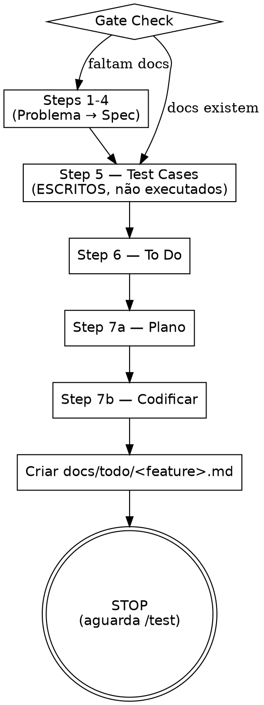

Roda o /method até a codificação (steps 1-7b), deixando test cases ESCRITOS mas PENDENTES de execução. Cria arquivo de tracking em `docs/todo/` para posterior `/test`.

<HARD-GATE>
NÃO execute steps 8-10 (code review, testing, done). O /fast PARA após codificar.
Ao finalizar, SEMPRE crie o arquivo de tracking em docs/todo/.
</HARD-GATE>

## REGRA FUNDAMENTAL: Precisão > Economia de Tempo ou Tokens

**Vale para todos os steps que /fast roda (1-7b), não apenas para escrever TCs.**

- Fazer rápido e errado = retrabalho. Fazer devagar e certo = entregue.
- NUNCA pule passos para "economizar tokens". Tokens são baratos comparados a bug em produção e perda de confiança.
- NUNCA marque algo como feito sem ter feito de verdade. "Feito" exige evidência (.md criado, código funcionando, plano completo).
- Se você se pegar pensando "posso pular isso, é simples" → PARE. Esse pensamento É a violação. Faça do jeito certo.
- Trade-off explícito: prefira gastar 10x mais tokens e acertar do que gastar 1x token e errar.

## Checklist

Crie tasks via TaskCreate para cada item abaixo.

**REGRA CRÍTICA: 1 TaskCreate = 1 task. NUNCA agrupe múltiplos itens em uma única chamada TaskCreate.**

- ❌ ERRADO: bundling "Steps 1-4 — Planning" em uma única task
- ❌ ERRADO: TaskCreate com array de N tasks numa única chamada
- ✅ CERTO: cada linha abaixo = 1 invocação TaskCreate separada e atômica
- Quando chegar no Step 5 (Test Cases), regra continua: no /test, cada GRUPO de TCs = 1 TaskCreate + cada TC individual dentro do grupo = 1 TaskCreate SEPARADO (duas camadas obrigatórias). /fast só ESCREVE os TCs aqui.


1. **Gate Check** — docs/01-problem/ a docs/04-spec/ existem para esta feature? Se não → executar steps faltantes
2. **Step 1 — Problema** — 1 frase em `docs/01-problem/<tópico>.md`
3. **Step 2 — User Stories** — "Como X, eu quero Y para Z" em `docs/02-user-stories/<tópico>.md`
4. **Step 3 — Use Cases** — Happy path + erros em `docs/03-use-cases/<tópico>.md`
5. **Step 4 — Spec** — Questioning Loop até zero gaps em `docs/04-spec/<tópico>.md`
6. **Step 5 — Test Cases** — TCs escritos ANTES de codar em `docs/05-test-cases/<tópico>.md` (PENDENTES de execução)
7. **Step 6 — To Do** — Tasks quebradas em `kanban/06-todo/<tópico>.md`
8. **Step 7a — Plano** — Plano autocontido em `kanban/07-implementation/<tópico>.md`
9. **Step 7b — Codificar** — Implementar seguindo o plano
10. **Tracking** — Criar `docs/todo/<feature>.md` com referências pendentes

## Fluxo



## Regras dos Steps

Cada step segue EXATAMENTE as mesmas regras do /method:

- **Inventário de Docs (UMA VEZ no início)** — Glob `docs/**/*.md` → Read CADA arquivo (conteúdo, não só nome) → montar mapa de tópicos existentes. Em cada step, usar esse mapa para decidir: atualizar existente (mesmo domínio/tópico) ou criar novo. Critério = domínio/tópico, não nome exato da feature.
- **Releitura acumulativa** — reler docs anteriores antes de cada step
- **Questioning Loop no Step 4** — múltiplos rounds até zero gaps
- **Disciplina de engenharia no Step 7b** — SOLID, refactoring obrigatório, segurança, performance
- **Consistência UI/UX (OBRIGATÓRIO)** — antes de criar/modificar qualquer componente visual, analise os padrões existentes no app. Use big apps (Instagram, Spotify, Gmail, Notion, iFood, Uber, Airbnb) como referência para decisões de design. Padrões visuais do app são LEI — não invente estilo novo.
- **i18n (OBRIGATÓRIO verificar no Step 7a)** — antes de codar (Step 7a, durante leitura do código existente), verifique se o projeto tem i18n configurado: procure por `next-intl`, `react-i18next`, `next-i18next`, `i18n.config*`, `i18next`, pasta `locales/`, `translations/`, `messages/`, `lang/`. Se SIM, identifique a biblioteca, arquivos de chaves e convenção de naming, e documente no plano. No Step 7b, TODA string user-facing nova/alterada DEVE ser chave de tradução, nunca literal — adicione a chave seguindo a convenção do projeto e traduza para todos os idiomas configurados. String literal hardcoded em projeto com i18n = bug.
- **TCs de Regressão no Step 7b** — tocou arquivo = mapeie impacto e crie TCs adicionais

### Complexidade-Driven (Steps 3 e 6) — OBRIGATÓRIO

`/fast` herda as regras de complexidade do `/method`:

- **Step 3 (Use Cases):** artifact-driven — derive UCs from stories using atores × fluxos × estados. Sem fórmula fixa. Ver /method Step 3.
- **Step 5 (Test Cases):** Specification-Based Test Design (ISTQB). 12 técnicas produzem ARTEFATOS → TCs derivados por COMPORTAMENTO (não por técnica) → User Journey TCs (~30% do total, com tipos main/extension/exception + coverage %). Layer 1 (spec-based ANTES do código) → Layer 2 (implementation) → Layer 3 (experience + exploratory).
- **NUNCA** default para 8 TCs. O número vem dos artefatos, não de preguiça.
- **Anti-redundância:** "Se eu deletar este TC, um bug passaria despercebido?" NÃO = redundante = deletar.
- **12 QA Techniques (Step 5):** (1) ECP, (2) BVA, (3) Decision Table, (4) STT (STT Gate + transition-pair coverage), (5) Pairwise, (6) Negative, (7) Concurrency, (8) Risk-Based, (9) Predicted Exploratory, (10) CRUD Testing (entity lifecycle matrix), (11) Security Testing (OWASP-based, condicional), (12) Accessibility/WCAG (condicional). Sanity check: fix 3-8, simples 8-20, média 20-50, complexa 50-100. Ver /method Step 5 para detalhes completos.
- **Step 5 Sub-Tasks:** cada técnica = 1 TaskCreate separado (5a-5m). Step 5d (STT) tem gate bloqueante + transition-pair. Ver /method para regras completas.

**Cobertura inclui obrigatoriamente:**
- Personas/roles, fluxos (feliz + alternativos + erros + concorrência), inputs, estados de dado, estados de sistema
- **Plataformas:** Web (desktop/tablet/mobile viewport) E **Mobile = Android E iOS sempre** (toda feature mobile = TCs nas duas plataformas)
- Cross-cutting: analytics, logging, permissões, regressão, a11y

**REFERÊNCIA COMPLETA:** Invoke /method para detalhamento de cada step (incluindo as tabelas de pontuação de complexidade). /fast não repete — apenas delimita o escopo (steps 1-7b).

## Arquivo de Tracking (OBRIGATÓRIO ao finalizar)

Ao concluir step 7b, crie `docs/todo/<feature>.md`:

```markdown
---
feature: <nome-da-feature>
status: pending-test
branch: <branch-atual>
created: <YYYY-MM-DD>
---

# <Nome da Feature>

## Problema
<1 frase do step 1>

## Referências
| Step | Arquivo |
|------|---------|
| 1 — Problema | docs/01-problem/<tópico>.md |
| 2 — User Stories | docs/02-user-stories/<tópico>.md |
| 3 — Use Cases | docs/03-use-cases/<tópico>.md |
| 4 — Spec | docs/04-spec/<tópico>.md |
| 5 — Test Cases | docs/05-test-cases/<tópico>.md |
| 6 — To Do | kanban/06-todo/<tópico>.md |
| 7 — Plano | kanban/07-implementation/<tópico>.md |

## Test Cases Pendentes
<Copie os NOMES dos TCs do step 6 com status PENDING — referência completa em docs/05-test-cases/>

## Notas para Review
<Pontos de atenção, decisões tomadas, riscos identificados durante a implementação>
```

### Regras do Tracking

- **Nunca crie tracking sem ter codificado** — tracking = prova de que steps 1-7b estão completos
- **Branch obrigatório** — registre a branch atual para o /test saber onde encontrar o código
- **Test Cases Pendentes** — liste TODOS os TCs por nome. /test usa esta lista como checklist
- **Notas para Review** — tudo que o revisor precisa saber (decisões polêmicas, workarounds, riscos)

## Finalizando

Ao criar o tracking file, informe ao usuário:

```
Feature "<nome>" implementada e documentada.
Tracking: docs/todo/<feature>.md
Test cases: X escritos, PENDENTES de execução.

Quando pronto para quality control, rode /test.
```

## Testing Gateway — /fast NÃO roda Step 9, mas tests permanecem OBRIGATÓRIAS para /test

**`pending-test` ≠ skipped. Feature SÓ é "done" depois que /test rodar TODAS as TCs com evidência.**

O tracking file (`docs/todo/<feature>.md`) é um CONTRATO:
- Prova que steps 1-7b estão completos
- Compromete que /test será rodado com: (a) duas camadas de TaskCreate (1 por grupo + 1 por TC individual); (b) **Audit Pré-Execução** bloqueante (ratio M==N publicado no chat antes do primeiro TC); (c) **Audit Pós-Execução** bloqueante (ratio C==N e E==N antes de Phase 4 / Done)
- Bloqueia claims de "feature done" enquanto status = `pending-test`

**Proibido em /fast:**
- ❌ Claim de que "feature is done" após codificar — só /test encerra
- ❌ Deletar tracking file antes de /test rodar
- ❌ Marcar TCs como PASSED sem execução via front (isso é /test, não /fast)
- ❌ Skippar Step 5 alegando "escrevo TCs quando for testar"
- ❌ Pular Step 7a (plano) — precisa estar pronto para que /test entenda contexto

## Red Flags — STOP e Revise

- "Vou pular o step 4 porque é simples" → NÃO. Questioning Loop sempre.
- "Não precisa de test cases para isso" → PRECISA. Step 5 é obrigatório.
- "Vou já fazer o code review" → NÃO. /fast PARA no 7b. Use /test depois.
- "O tracking é opcional" → NÃO. Sem tracking, /test não sabe o que testar.
- "Vou codar sem plano" → NÃO. Step 7a antes de 7b. Sempre.
- "Feature tá done, testing depois é detalhe" → NÃO. Done requer evidência. Status `pending-test` impede claim de done.
- "Vou bundle as tasks pra não poluir" → NÃO. 1 TaskCreate = 1 task. Bundling proibido.
- "Vou escrever TCs depois, na hora de testar" → NÃO. Step 5 ANTES de codar. Sem exceções.
- "Vou marcar como done e o /test confirma depois" → NÃO. /fast SEMPRE termina em `pending-test`. Done é função do /test.
