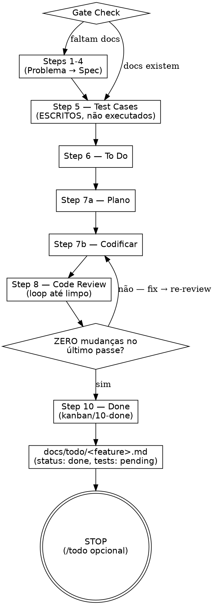

Roda o /method em ritmo rápido — steps 1-8 + 10 (planejamento, codificação, code review, done) — pulando apenas step 9 (testing via front) e step 11 (ship). Test cases ESCRITOS no step 5 ficam PENDENTES de execução; usuário pode rodar `/todo` depois para validar via front, ou validar manualmente. Cria tracking em `docs/todo/<feature>.md` com `status: done` + `tests: pending`.

<HARD-GATE>
NÃO crie branch. Trabalhe SEMPRE na branch atual — proibido `git checkout -b`, `git switch -c`, `git branch <nome>` ou qualquer criação/troca de branch.
EXECUTE step 8 (code review) e step 10 (done). Sem code review limpo, /fast não termina.
NÃO execute step 9 (testing via front) — isso é função do /todo (chamado opcionalmente depois).
NÃO execute step 11 (ship) — isso continua só no /method completo.
Ao finalizar, SEMPRE crie o arquivo de tracking em `docs/todo/` com `tests: pending`.
</HARD-GATE>

## REGRA FUNDAMENTAL: Precisão > Economia de Tempo ou Tokens

**Vale para todos os steps que /fast roda (1-8 + 10), não apenas para escrever TCs.**

- Fazer rápido e errado = retrabalho. Fazer devagar e certo = entregue.
- NUNCA pule passos para "economizar tokens". Tokens são baratos comparados a bug em produção e perda de confiança.
- NUNCA marque algo como feito sem ter feito de verdade. "Feito" exige evidência (.md criado, código funcionando, plano completo).
- Se você se pegar pensando "posso pular isso, é simples" → PARE. Esse pensamento É a violação. Faça do jeito certo.
- Trade-off explícito: prefira gastar 10x mais tokens e acertar do que gastar 1x token e errar.

## Checklist

Crie tasks via TaskCreate para cada item abaixo.

**REGRA CRÍTICA: 1 TaskCreate = 1 task. NUNCA agrupe múltiplos itens em uma única chamada TaskCreate.**

- ❌ ERRADO: bundling "Steps 1-4 — Planning" em uma única task
- ❌ ERRADO: TaskCreate com array de N tasks numa única chamada
- ✅ CERTO: cada linha abaixo = 1 invocação TaskCreate separada e atômica
- Quando chegar no Step 5 (Test Cases), regra continua: no /todo, cada GRUPO de TCs = 1 TaskCreate + cada TC individual dentro do grupo = 1 TaskCreate SEPARADO (duas camadas obrigatórias). /fast só ESCREVE os TCs aqui.


1. **Gate Check** — docs/01-problem/ a docs/04-spec/ existem para esta feature? Se não → executar steps faltantes
2. **Step 1 — Problema** — 1 frase em `docs/01-problem/<tópico>.md`
3. **Step 2 — User Stories** — "Como X, eu quero Y para Z" em `docs/02-user-stories/<tópico>.md`
4. **Step 3 — Use Cases** — Happy path + erros em `docs/03-use-cases/<tópico>.md`
5. **Step 4 — Spec** — Questioning Loop até zero gaps em `docs/04-spec/<tópico>.md`
6. **Step 5 — Test Cases** — TCs escritos ANTES de codar em `docs/05-test-cases/<tópico>.md` (PENDENTES de execução pelo /todo)
7. **Step 6 — To Do** — Tasks quebradas em `kanban/06-todo/<tópico>.md`
8. **Step 7a — Plano** — Plano autocontido em `kanban/07-implementation/<tópico>.md`
9. **Step 7b — Codificar** — Implementar seguindo o plano
10. **Step 8 — Code Review** — Loop até 100% limpo + relatório em `kanban/08-code-review/<tópico>.md`. QUALQUER mudança de código volta ao 7b. Sai do loop com ZERO mudanças no último passe.
11. **Step 10 — Done** — Criar `kanban/10-done/<tópico>.md` com resumo + links. Deletar `kanban/06-todo/<tópico>.md`.
12. **Tracking** — Criar `docs/todo/<feature>.md` com `status: done` + `tests: pending` para validação opcional via /todo

## Fluxo



## Regras dos Steps

Cada step segue EXATAMENTE as mesmas regras do /method:

- **Inventário de Docs (UMA VEZ no início)** — Glob `docs/**/*.md` → Read CADA arquivo (conteúdo, não só nome) → montar mapa de tópicos existentes. Em cada step, usar esse mapa para decidir: atualizar existente (mesmo domínio/tópico) ou criar novo. Critério = domínio/tópico, não nome exato da feature.
- **Releitura acumulativa** — reler docs anteriores antes de cada step
- **Questioning Loop no Step 4** — múltiplos rounds até zero gaps
- **Disciplina de engenharia no Step 7b** — SOLID, refactoring obrigatório, segurança, performance
- **Consistência UI/UX (OBRIGATÓRIO)** — antes de criar/modificar qualquer componente visual, analise os padrões existentes no app. Use big apps (Instagram, Spotify, Gmail, Notion, iFood, Uber, Airbnb) como referência para decisões de design. Padrões visuais do app são LEI — não invente estilo novo.
- **i18n (OBRIGATÓRIO verificar no Step 7a)** — antes de codar (Step 7a, durante leitura do código existente), verifique se o projeto tem i18n configurado: procure por `next-intl`, `react-i18next`, `next-i18next`, `i18n.config*`, `i18next`, pasta `locales/`, `translations/`, `messages/`, `lang/`. Se SIM, identifique a biblioteca, arquivos de chaves e convenção de naming, e documente no plano. No Step 7b, TODA string user-facing nova/alterada DEVE ser chave de tradução, nunca literal — adicione a chave seguindo a convenção do projeto e traduza para todos os idiomas configurados. String literal hardcoded em projeto com i18n = bug.
- **TCs de Regressão no Step 7b** — tocou arquivo = mapeie impacto e crie TCs adicionais

### Complexidade-Driven (Steps 3 e 6) — OBRIGATÓRIO

`/fast` herda as regras de complexidade do `/method`:

- **Step 3 (Use Cases):** artifact-driven — derive UCs from stories using atores × fluxos × estados. Sem fórmula fixa. Ver /method Step 3.
- **Step 5 (Test Cases):** Specification-Based Test Design (ISTQB). 12 técnicas produzem ARTEFATOS → TCs derivados por COMPORTAMENTO (não por técnica) → User Journey TCs (~30% do total, com tipos main/extension/exception + coverage %). Layer 1 (spec-based ANTES do código) → Layer 2 (implementation) → Layer 3 (experience + exploratory).
- **NUNCA** default para 8 TCs. O número vem dos artefatos, não de preguiça.
- **Anti-redundância:** "Se eu deletar este TC, um bug passaria despercebido?" NÃO = redundante = deletar.
- **12 QA Techniques (Step 5):** (1) ECP, (2) BVA, (3) Decision Table, (4) STT (STT Gate + transition-pair coverage), (5) Pairwise, (6) Negative, (7) Concurrency, (8) Risk-Based, (9) Predicted Exploratory, (10) CRUD Testing (entity lifecycle matrix), (11) Security Testing (OWASP-based, condicional), (12) Accessibility/WCAG (condicional). Sanity check: fix 3-8, simples 8-20, média 20-50, complexa 50-100. Ver /method Step 5 para detalhes completos.
- **Step 5 Sub-Tasks:** cada técnica = 1 TaskCreate separado (5a-5m). Step 5d (STT) tem gate bloqueante + transition-pair. Ver /method para regras completas.

**Cobertura inclui obrigatoriamente:**
- Personas/roles, fluxos (feliz + alternativos + erros + concorrência), inputs, estados de dado, estados de sistema
- **Plataformas:** Web (desktop/tablet/mobile viewport) E **Mobile = Android E iOS sempre** (toda feature mobile = TCs nas duas plataformas)
- Cross-cutting: analytics, logging, permissões, regressão, a11y

**REFERÊNCIA COMPLETA:** Invoke /method para detalhamento de cada step (incluindo as tabelas de pontuação de complexidade). /fast não repete — apenas delimita o escopo (steps 1-8 + 10).

## Loop Step 7b → Step 8 — Obrigatório

```
Codificar (7b) → Code Review (8)
  ↳ Tudo PASSED sem mudanças de código → Step 10
  ↳ FAILED ou fix necessário → Fix em 7b → volta ao Code Review (8)
```

**QUALQUER mudança de código (fix de bug, correção de review) invalida o Code Review anterior.** O ciclo SÓ encerra com Code Review 100% limpo e ZERO mudanças no último passe.

**Diferença vs /method:** o /method tem loop 7-8-9 (inclui re-test). O /fast tem loop 7-8 (não há re-test no /fast — testing é função do /todo).

| Racionalização | Realidade |
|----------------|-----------|
| "Fix é trivial, não precisa re-review" | Re-review obrigatório. Qualquer mudança = nova validação. |
| "Já validei mentalmente" | Não. Step 8 = relatório formal em `kanban/08-code-review/`. |
| "Vou bundlar fixes e revisar tudo no fim" | Não. Cada fix = re-review. |

## Arquivo de Tracking (OBRIGATÓRIO ao finalizar)

Ao concluir step 10, crie `docs/todo/<feature>.md`:

```markdown
---
feature: <nome-da-feature>
status: done
tests: pending
branch: <branch-atual>
created: <YYYY-MM-DD>
---

# <Nome da Feature>

## Problema
<1 frase do step 1>

## Referências
| Step | Arquivo |
|------|---------|
| 1 — Problema | docs/01-problem/<tópico>.md |
| 2 — User Stories | docs/02-user-stories/<tópico>.md |
| 3 — Use Cases | docs/03-use-cases/<tópico>.md |
| 4 — Spec | docs/04-spec/<tópico>.md |
| 5 — Test Cases | docs/05-test-cases/<tópico>.md |
| 6 — To Do | kanban/06-todo/<tópico>.md (deletado no Step 10) |
| 7 — Plano | kanban/07-implementation/<tópico>.md |
| 8 — Code Review | kanban/08-code-review/<tópico>.md |
| 10 — Done | kanban/10-done/<tópico>.md |

## Test Cases Pendentes
<Copie os NOMES dos TCs do step 5 com status PENDING — referência completa em docs/05-test-cases/>

## Notas para QA
<Pontos de atenção, decisões tomadas, riscos identificados durante a implementação. O /todo lê isso antes de validar.>
```

### Regras do Tracking

- **Nunca crie tracking sem ter feito Steps 8 e 10** — tracking = prova de que feature está done (kanban em `kanban/10-done/`) com TCs pendentes para /todo opcional
- **Frontmatter dual-field obrigatório**: `status: done` (dev done) + `tests: pending` (QA pendente)
- **Branch obrigatório** — registre a branch atual para o /todo encontrar o código
- **Test Cases Pendentes** — liste TODOS os TCs por nome. /todo usa esta lista como checklist
- **Notas para QA** — tudo que o validador precisa saber (decisões polêmicas, workarounds, riscos)

## Finalizando

Ao concluir Step 10 e criar o tracking file, informe ao usuário:

```
Feature "<nome>" — Dev completo.
Code Review: APROVADO | Kanban: kanban/10-done/<feature>.md
Tracking: docs/todo/<feature>.md (status: done, tests: pending)
Test cases: X escritos, PENDENTES de execução.

Para validar QA via front depois, rode /todo. Caso contrário, valide manualmente.
```

## QA Gateway — /fast roda Steps 8 + 10, mas Step 9 (testing via front) é OPCIONAL via /todo

**`tests: pending` ≠ blocking. Feature está "done" no sentido de dev encerrado (Steps 8 + 10 rodaram). QA via front é responsabilidade do /todo, opcional.**

O tracking file (`docs/todo/<feature>.md`) é um RESUMO:
- Prova que steps 1-8 + 10 estão completos
- Lista TCs escritos que ainda não rodaram via front
- /todo pode usar esta lista depois para validação

**Proibido em /fast:**
- ❌ Skippar Step 8 (code review) alegando "vou rodar /todo depois" — code review é gate interno do /fast
- ❌ Marcar Step 10 (done) sem ter rodado Step 8 limpo (zero mudanças no último passe)
- ❌ Marcar TCs como PASSED sem execução via front (isso é /todo, não /fast — /fast só ESCREVE TCs)
- ❌ Skippar Step 5 alegando "escrevo TCs quando for testar"
- ❌ Pular Step 7a (plano) — necessário para Step 8 (code review) ter referência
- ❌ Rodar Step 9 (testing via front) — isso é /todo, não /fast
- ❌ Rodar Step 11 (ship) — isso é /method completo

## Red Flags — STOP e Revise

- "Vou pular o step 4 porque é simples" → NÃO. Questioning Loop sempre.
- "Não precisa de test cases para isso" → PRECISA. Step 5 é obrigatório.
- "Vou pular o code review (step 8) — feature é trivial / urgente / CEO pediu" → NÃO. Step 8 é gate interno do /fast. Sem ele, /fast não termina.
- "Vou marcar Step 10 (done) sem Step 8 limpo" → NÃO. Step 10 só após Step 8 com ZERO mudanças no último passe.
- "Vou rodar /todo agora porque feature é importante" → NÃO. /fast PARA no Step 10. /todo é INVOCADO pelo usuário, não pelo /fast.
- "Vou tentar rodar Step 11 (ship) também" → NÃO. /fast termina no Step 10. Ship só no /method.
- "O tracking é opcional" → NÃO. Sem tracking, /todo não sabe o que validar.
- "Vou codar sem plano" → NÃO. Step 7a antes de 7b. Sempre.
- "Vou bundle as tasks pra não poluir" → NÃO. 1 TaskCreate = 1 task. Bundling proibido.
- "Vou escrever TCs depois, na hora de testar" → NÃO. Step 5 ANTES de codar. Sem exceções.
- "Step 8 sem TCs executados é review de fachada" → NÃO. Step 8 valida lógica/segurança/padrões contra os TCs escritos (mesmo que pendentes de execução).
- "Vou fazer Step 8 mental, sem relatório" → NÃO. Step 8 = relatório formal em `kanban/08-code-review/`. Mental ≠ documentado ≠ feito.
