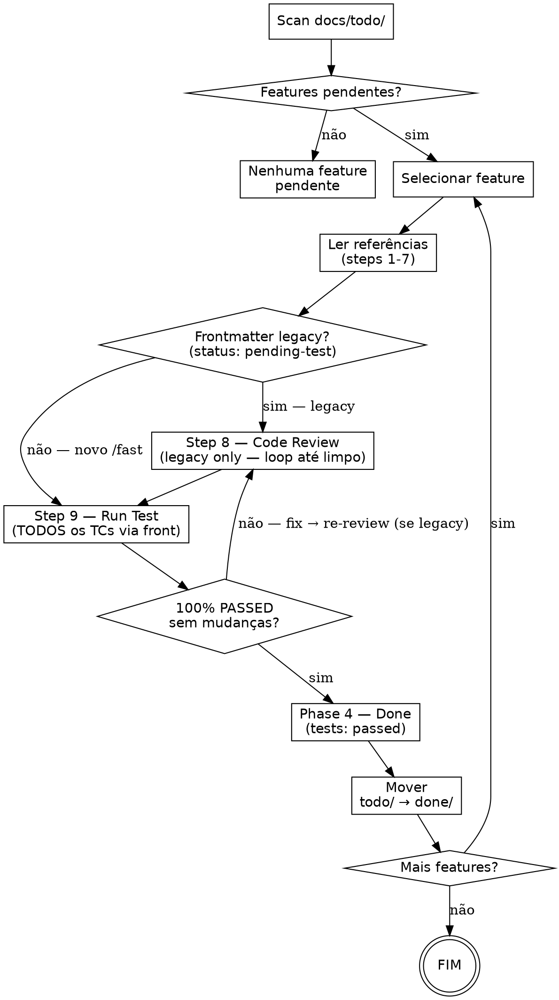

Executa a fase de QA (step 9 do /method) para features pendentes em `docs/todo/`.
/fast já entregou o kanban em `kanban/10-done/`; o /todo apenas valida via front e move o tracking para `docs/done/` com `tests: passed`.

Para features legacy (`status: pending-test`, criadas pelo /fast antigo), /todo também roda Step 8 (Code Review) e cria `kanban/10-done/` — esses steps não foram executados pelo /fast antigo.

<HARD-GATE>
NÃO marque test cases como PASSED sem executar via front.
NÃO avance da execução para Done sem 100% PASSED com ZERO mudanças de código.
QUALQUER fix de código invalida o ciclo: volta ao Code Review (se legacy) ou re-executa TCs e retesta TUDO.
</HARD-GATE>

## REGRA FUNDAMENTAL: Precisão > Economia de Tempo ou Tokens

- Tokens são baratos. Bug em produção é caro. **Execute, não deduza.**
- "Front é front e ponto" — quando o protocolo diz front, é front. Sem atalhos.
- Se você se pegar pensando "vou pular este TC para economizar" → PARE. Esse pensamento É a violação. Execute.
- Trade-off explícito: prefira gastar 10x mais tokens e ter teste forte do que gastar 1x token e marcar PASSED falsamente.

## Checklist

Crie tasks via TaskCreate para cada item:

1. **Scan** — Listar features pendentes em `docs/todo/`
2. **Selecionar** — User escolhe qual feature (ou todas)
3. **Carregar contexto** — Ler TODOS os docs de referência (steps 1-7)
4. **Step 8 — Code Review** — Loop até 100% limpo + relatório
5. **Step 9 — Run Test** — TODOS os TCs via front com screenshot
6. **Step 10 — Done** — Resumo + mover para `docs/done/`

## Fluxo



---

## Phase 1 — Scan e Seleção

1. `Glob docs/todo/*.md`
2. Ler frontmatter de cada arquivo (`feature`, `status`, `tests`, `branch`, `created`)
3. **Filtro:** entra no scan o arquivo que satisfaça QUALQUER um:
   - `tests: pending` (novo, criado pelo /fast pós-refactor)
   - `status: pending-test` (legacy, criado pelo /fast pré-refactor)
4. Marcar cada arquivo como `[novo]` ou `[legacy]` conforme frontmatter
5. Apresentar lista:

```
Features pendentes de QA:

1. <feature-A> (branch: X, criado: YYYY-MM-DD) [novo]
2. <feature-B> (branch: Y, criado: YYYY-MM-DD) [legacy]

Qual feature deseja validar? (número, nome, ou "all")
```

6. Se `$ARGUMENTS` fornecido → usar como seleção
7. Se apenas 1 feature → selecionar automaticamente
8. Se "all" → processar uma por vez na ordem do tracking

---

## Phase 2 — Code Review (Step 8 do /method)

### Quando rodar Code Review

| Frontmatter da feature | Code Review? | Por quê |
|------------------------|--------------|---------|
| `tests: pending` (novo, /fast pós-refactor) | ❌ **NÃO** rodar — já rodou no /fast | Step 8 já foi executado pelo /fast. Há relatório em `kanban/08-code-review/<feature>.md`. /todo só lê o relatório como contexto antes da execução. |
| `status: pending-test` (legacy, /fast pré-refactor) | ✅ **SIM** rodar | /fast antigo parava em 7b; Step 8 nunca rodou. /todo precisa fazê-lo agora. |

**Regra inviolável:** features novas NÃO repetem code review. Features legacy SEMPRE rodam. Sem exceção. Se o frontmatter for ambíguo (sem `tests:` e sem `status: pending-test`), default para legacy (rodar review).

**Se a feature for `[novo]`, pule para Phase 3.** As subseções abaixo (Preparação, Revisão em Loop, Relatório) aplicam-se APENAS a features `[legacy]`.

### Preparação

Antes de revisar, ler TODOS os docs da feature (tabela de referências do tracking file):
- Problema (1), User Stories (2), Use Cases (3), Spec (4), To Do (5), Test Cases (6), Plano (7)

### Revisão em Loop

```
REPETIR até 100% limpo:
  1. git diff main...HEAD (filtrar arquivos da feature)
  2. Reler plano (7a) — código implementa TUDO?
  3. Reler TCs (6) — todos cenários cobertos?
  4. Reler use cases (3) — edge cases tratados?
  5. Revisar CADA arquivo alterado:
     - Código morto / imports não usados?
     - Bugs lógicos / edge cases?
     - Padrões do projeto violados?
     - Segurança (XSS, injection, secrets, auth bypass)?
     - Performance (N+1, re-renders, memory leaks)?
     - Consistência com codebase?
     - Faz EXATAMENTE o que use cases pedem — nem mais, nem menos?
     - Regra "tocou = refatora" seguida?
  6. Problema encontrado → corrigir IMEDIATAMENTE → voltar ao 1
  7. Loop até ZERO issues — NÃO aceitar "bom o suficiente"
```

### Relatório (OBRIGATÓRIO)

**Organizar** `kanban/08-code-review/<tópico>.md`:

```markdown
# Relatório de Code Review — <feature>

## Resumo
- Branch | Total de iterações do loop | Data

## Arquivos Analisados
| Arquivo | Linhas +/- | Tipo | Veredicto |

## Problemas Encontrados e Corrigidos
### Issue #N — [título]
- Arquivo | Severidade | Categoria | Correção aplicada | Iteração

## Análise de Cobertura
- Stories atendidas | Use cases cobertos | TCs preparados | Gaps

## Análise de Segurança
Input validation | Auth | Dados sensíveis | Injection vectors

## Veredicto Final
- Status: APROVADO / REQUER correções
- Confiança: Alta/Média/Baixa
- Notas para o teste: pontos críticos
```

---

## Phase 3 — Testing (Step 9 do /method)

Executar TODOS os test cases listados no tracking file + `docs/05-test-cases/`.

### Pre-Flight Blocker Contract (OBRIGATÓRIO — ANTES de tudo)

**ANTES de rodar qualquer TC, ANTES do batching:**

```
PRE-FLIGHT:
  1. Listar TODOS os N TCs (tracking file + docs/05-test-cases/)
  2. Para CADA TC: qual tenant/seed/user/hardware/flag precisa?
  3. Classificar: READY / NEEDS SETUP / BLOCKED
  4. Reportar: "Pre-flight: X READY, Y NEEDS SETUP, Z BLOCKED por: [lista]"
  5. Z > 0 → PARAR e perguntar ao user. Nenhum TC roda até resposta.
  6. Z == 0 → preparar NEEDS SETUP e prosseguir
```

### Prediction-Execution-Reconciliation (OBRIGATÓRIO)

Início: `"Executando N TCs. Produzirei N screenshots."`
Fim (ANTES de qualquer report): `"Reconciliação: Predicted N, Evidence M, Delta N-M. TCs sem evidência: [lista] = NOT_RUN."`

**Delta > 0 → NOT_RUN. Não "coberto por", não "equivalente a".**

### Regras de Integridade

1. **Disclosure ≠ compliance.** Dizer "não rodei X" NÃO torna OK marcar PASSED.
2. **HOW vs WHAT.** Pragmatismo do user = otimizar execução (HOW), nunca reduzir escopo (WHAT).
3. **Conceitos proibidos.** "Verificado via código", "redundante com outro TC", "low risk skip", "N/A neste build" = violação.
4. **Resposta binária.** "All passed?" → "X de N PASSED. Y NOT_RUN. Z FAILED." Nunca "mostly yes, with caveats".

### TCs em Tasks — Duas Camadas de TaskCreate (OBRIGATÓRIO — ANTES de executar qualquer TC)

**SEMPRE crie tasks em DUAS camadas: uma por GRUPO temático E uma por cada TC INDIVIDUAL dentro do grupo.**

**REGRA ABSOLUTA: Cada grupo de TCs = 1 TaskCreate. Cada TC individual dentro do grupo = 1 TaskCreate SEPARADO. Ambas as camadas obrigatórias.**

```
PROCEDIMENTO (executar PRIMEIRO, antes de qualquer TC):
  1. Ler TODOS os TCs do tracking file + docs/05-test-cases/ (feature + regressão)
  2. Contar total de TCs (N)
  3. Agrupar em batches de ~10 TCs por afinidade temática (área, tela, fluxo)
  4. CAMADA 1 — Para CADA grupo, criar 1 TaskCreate:
     - TaskCreate: "Grupo 01: TC-001 a TC-010 — [área/tema]"
     - TaskCreate: "Grupo 02: TC-011 a TC-020 — [área/tema]"
     - (continuar até cobrir TODOS os TCs)
  5. CAMADA 2 — Para CADA TC individual dentro de CADA grupo, criar 1 TaskCreate SEPARADO:
     - TaskCreate: "TC-001: [nome do TC]"
     - TaskCreate: "TC-002: [nome do TC]"
     - ... (1 invocação por TC, SEM array/lista, SEM bundling)
  6. TaskUpdate nos DOIS níveis:
     - Grupo: in_progress ao iniciar primeiro TC, completed quando TODOS do grupo passarem
     - TC individual: in_progress ao iniciar, completed após PASSED com evidência
```

**NÃO execute TCs como lista solta.** Ambas as camadas de TaskCreate são OBRIGATÓRIAS. Sem TaskCreate em AMBAS = Phase 3 NÃO iniciou.

| Racionalização | Realidade |
|----------------|-----------|
| "Tasks de grupo bastam, TCs individuais são desnecessários" | NÃO. Grupo = organização. TC individual = rastreamento granular. Ambas obrigatórias. BLOQUEADO. |
| "Só crio 1 task por grupo" | NÃO. Grupo + TC individual. BLOQUEADO. |

### Audit Pré-Execução — BLOQUEANTE (publicar no chat ANTES do primeiro TC)

**Depois de criar os TaskCreate das duas camadas e ANTES de tocar em qualquer ferramenta de teste (Playwright, emulator, curl), publique este bloco visualmente no chat. Audit ausente = execução não iniciou.**

```markdown
## Audit Pré-Execução — TaskCreate 1:1
- TCs totais (tracking + docs/05-test-cases/): **N**
- TaskCreate de grupo criados: **G** — listar (TaskID → grupo)
- TaskCreate individuais criados: **M** — listar (TaskID → TC-ID)
- Ratio M == N? ✅ SIM / ❌ NÃO — TCs sem task individual: [listar TC-IDs]
- Ratio G cobre todos os TCs? ✅ SIM / ❌ NÃO
- **Veredicto:** ✅ LIBERADO para executar / ❌ BLOQUEADO — criar tasks faltantes AGORA e republicar
```

**❌ BLOQUEADO = PROIBIDO executar qualquer TC.** Crie as tasks faltantes, republique o audit ✅, só então inicie o Loop. Executar TC sem o audit ✅ visível = violação automática (cheating visível).

| Racionalização proibida | Realidade |
|------------------------|-----------|
| "Já declarei nas Duas Camadas, audit é redundante" | NÃO. Declaração em prosa ≠ audit publicado com números. BLOQUEADO. |
| "Conto de cabeça, não preciso publicar" | NÃO. Audit silencioso = inexistente. BLOQUEADO. |
| "Rodo enquanto crio o que falta" | NÃO. Audit ✅ antes de TUDO. BLOQUEADO. |
| "Faltam 2 de 30, começo pelos 28" | NÃO. Atomicidade. 100% ou BLOQUEADO. |

### Loop de Execução

```
REPETIR até todos passarem SEM NENHUMA MUDANÇA DE CÓDIGO:
  1. tsc/lint — se falhar, corrigir antes de testar
  2. Consultar notas do relatório de review (8)
  3. Para CADA batch (task):
     a. TaskUpdate → in_progress
     b. CADA TC do batch: executar DO ZERO via:
        - Web → Playwright MCP (mcp__playwright-*)
        - Android → AVD emulator
        - iOS → iOS simulator (Xcode) ou device físico
        - Login como usuário real
        - Seguir CADA passo do TC
        - Screenshot como prova de cada PASSED
     c. PASSED (com screenshot) ou FAILED (motivo detalhado)
     d. Bug encontrado → corrigir IMEDIATAMENTE → ATENÇÃO:
        QUALQUER fix invalida o ciclo:
        - `[legacy]`: volta ao Phase 2 (Code Review) → retesta TUDO
        - `[novo]`: volta ao Phase 3 (re-executa TODOS os TCs do zero — code review do /fast cobre apenas o código original, fixes do /todo são código novo não revisado; se fix for não-trivial, considere escalar de volta para /fast e re-rodar Step 8)
     e. Todos TCs do batch PASSED → TaskUpdate → completed
  4. Todos PASSED sem mudança → Phase 4
```

### Audit Pós-Execução — BLOQUEANTE (publicar no chat ANTES de Phase 4)

**Quando achar que o Loop terminou e ANTES de publicar qualquer resumo, relatório ou avançar para Phase 4 (Done), publique este bloco. Audit ausente = Phase 3 não terminou.**

```markdown
## Audit Pós-Execução — Execução 1:1
- Tasks individuais esperadas (do Audit Pré): **N**
- Tasks individuais com status `completed`: **C** — listar (TaskID → TC-ID)
- TCs com evidência (screenshot path em `kanban/09-run-test/<tópico>.md`): **E** — listar (TC-ID → path)
- Ratio C == N? ✅ / ❌ — tasks pendentes: [listar]
- Ratio E == N? ✅ / ❌ — TCs sem screenshot: [listar]
- Status agregado: **N PASSED**, **0 FAILED**, **0 NOT_RUN**, **0 SKIPPED**, **0 BLOCKED** ✅ / ❌
- Último ciclo sem mudanças de código? ✅ / ❌
- **Veredicto:** ✅ LIBERADO para Phase 4 (Done) / ❌ BLOQUEADO — voltar ao Loop
```

**❌ BLOQUEADO = PROIBIDO avançar para Phase 4, PROIBIDO resumo de conclusão, PROIBIDO mover tracking para `docs/done/`.** Volte ao Loop, execute pendentes, produza evidência, republique o audit.

| Racionalização proibida | Realidade |
|------------------------|-----------|
| "28 de 30 passaram, o resto é trivial, avanço" | NÃO. Delta > 0 = BLOQUEADO. Atomicidade. |
| "TC X é redundante com Y que já rodou" | NÃO. Sem herança. Execute X. BLOQUEADO. |
| "Marco os 2 faltantes PASSED e documento depois" | NÃO. Sem evidência = NOT_RUN. BLOQUEADO. |
| "Reporto parcial enquanto os últimos rodam" | NÃO. Audit ✅ antes de QUALQUER report. BLOQUEADO. |

**MOBILE = ANDROID E iOS, SEMPRE.** Nenhuma feature mobile pode ser marcada PASSED rodando em apenas uma plataforma. Se a iOS não estiver disponível na máquina, peça ao usuário antes de marcar PASSED — não invente.

### FRONT É FRONT — REGRA ABSOLUTA

**Quando o protocolo diz "executar via front", você EXECUTA via front. Sem atalhos, sem deduzir do código, sem economizar tokens.**

Por que: o teste front é exponencialmente mais forte que análise de código. Captura bugs de integração, timing, layout, comportamento real, browser quirks. Análise de código captura: lógica isolada. **Análise de código NÃO substitui front. Nunca.**

#### Padrões de Burla — TODOS PROIBIDOS

| Burla | Por que está PROIBIDO |
|-------|-----------------------|
| "Verifiquei no código, marco PASSED" | Código != comportamento. Execute via front. |
| "tsc passou, está testado" | tsc verifica tipos, não comportamento. |
| "Já testei TC parecido, esse herda" | Cada TC roda isolado. Sem herança. |
| "A tela carregou, marco PASSED" | Tela carregar != TC passar. RESULTADO ESPERADO ou FAILED. |
| "TC trivial, vou pular" | Trivial != opcional. Execute todos. |
| "Vou economizar tokens não rodando" | Tokens são baratos. Execute. |
| "BLOCKED" | Não está bloqueado. Resolva o impedimento. |
| "Marco PASSED, screenshot depois" | Sem screenshot agora = sem TC. |
| "Testei só Android, iOS deve igual" | iOS é outro TC. Execute. |
| "O usuário corrige se errar" | Sua responsabilidade. Execute. |

### Resultados (OBRIGATÓRIO)

**Organizar** `kanban/09-run-test/<tópico>.md`:

```markdown
# Resultados de Teste — <feature>

## Resumo
- Total TCs | Passed | Failed | Iterações do ciclo review-test

## Resultados
| TC | Status | Screenshot | Notas |

## Ciclos de Fix (se houve)
| Fix | Arquivo | Iteração | Re-review necessário? |
```

### ANTI-PADRÕES PROIBIDOS

```
NUNCA SKIP ou BLOCKED — resolva o impedimento
NUNCA "Ran tsc, no errors" — tsc é pré-requisito, não teste
NUNCA "Verified via code" — execute via FRONT com screenshot
NUNCA "Fix was trivial, doesn't need re-test" — QUALQUER fix invalida o ciclo (legacy: volta Phase 2; novo: re-executa Phase 3)
NUNCA batch fixes — corrija CADA bug IMEDIATAMENTE ao encontrar
NUNCA "I'll test the rest later" — TODOS os TCs, AGORA
```

---

## Phase 4 — Done

### Para features `[novo]` (`tests: pending` → `tests: passed`)

`/fast` já criou `kanban/10-done/<tópico>.md`. /todo apenas:

1. **Mover** tracking file:
   ```bash
   mkdir -p docs/done
   mv docs/todo/<feature>.md docs/done/<feature>.md
   ```

2. **Atualizar frontmatter** do arquivo movido:
   ```yaml
   ---
   feature: <nome>
   status: done
   tests: passed       # era 'pending'
   branch: <branch>
   created: <YYYY-MM-DD>
   tested: <YYYY-MM-DD>  # nova chave: dia que /todo rodou
   ---
   ```

3. **Anexar resumo** ao kanban/10-done existente, sob nova seção:
   ```markdown
   ## QA (rodado por /todo em <data>)
   - Total TCs: X | PASSED: X | FAILED: 0
   - Evidências: kanban/09-run-test/<feature>.md
   ```

### Para features `[legacy]` (`status: pending-test`)

/fast antigo NÃO criou kanban/10-done. /todo precisa criar:

1. **Criar** `kanban/10-done/<tópico>.md`:
   - Links para todos os docs (steps 1-9)
   - Arquivos de código alterados
   - Status final dos TCs (todos PASSED)
   - Tasks completadas do to-do

2. **Mover e reescrever frontmatter** do tracking:
   ```yaml
   ---
   feature: <nome>
   status: done
   tests: passed
   branch: <branch>
   created: <YYYY-MM-DD original>
   tested: <YYYY-MM-DD>
   ---
   ```
   ```bash
   mkdir -p docs/done
   mv docs/todo/<feature>.md docs/done/<feature>.md
   ```

3. **Deletar** todo da feature se existir: `rm kanban/06-todo/<tópico>.md`

### Comum a ambos

4. **Informar**:
   ```
   Feature "<nome>" — QA completo.
   TCs: X/X PASSED | Status: done, tests: passed
   Tracking movido para docs/done/<feature>.md
   ```

5. **Mais features?** → voltar ao Phase 1 (Seleção) para a próxima

---

## Golden Rule

**Encontrou problema? CORRIJA IMEDIATAMENTE.**

- Não documente para depois
- Não pule para o próximo TC
- Não "note para review"
- Não "vou juntar tudo no final"
- PARE e CORRIJA AGORA

## Red Flags — STOP e Revise

- "Feature é `[legacy]`, code review é desnecessário" → NÃO. Para `[legacy]`, Step 8 é obrigatório (não foi rodado pelo /fast antigo).
- "Feature é `[novo]`, vou rodar code review pra garantir" → NÃO. Para `[novo]`, /fast já rodou Step 8. Re-rodar é desperdício e contradiz o contrato.
- "Esse TC é trivial, posso pular" → NÃO. TODOS os TCs.
- "Vou marcar como PASSED sem screenshot" → NÃO. Screenshot = prova.
- "O fix foi pequeno, não precisa re-test" → PRECISA. QUALQUER fix volta à execução completa.
- "tsc passou, está testado" → tsc verifica tipos, não comportamento.
- "BLOCKED — não consigo acessar" → Resolva o impedimento. Pergunte ao usuário se necessário.
